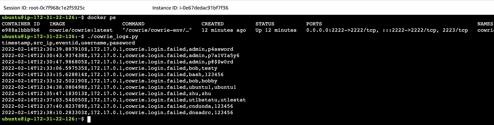

# Cowrie honeypot deployment using Packer, Terraform, Ansible and Docker



## About

This is a repository containing a [Ansible](https://www.ansible.com/) role
to deploy a [Cowrie](https://github.com/cowrie/cowrie) honeypot container
using [Docker in rootless mode](https://github.com/konstruktoid/ansible-role-docker-rootless).

It is used to gather additional passwords and usernames for the password lists
used by
[konstruktoid/ansible-role-hardening](https://github.com/konstruktoid/ansible-role-hardening/blob/master/templates/usr/share/dict/passwords.list.j2)
and [konstruktoid/hardening](https://github.com/konstruktoid/hardening/blob/master/misc/passwords.list).

The list with gathered passwords and usernames are available in the [konstruktoid/honeypot-passwords](https://github.com/konstruktoid/honeypot-passwords)
repository.

## Variables and defaults

```yaml
docker_user: cowrie
rootful_enabled: true
```

`docker_user` sets the username of the account that will run the container if
in rootless mode and the `cowrie` configuration and logs will be stored in the
user home directory, `{{ docker_user_info.home }}/cowrie`.

`rootful_enabled` will start the container as the root user and use
`--net=host`. This is required in order to gather the source address of the
attack.

## Usage

### ansible-pull example

```sh
$ ansible-galaxy install --ignore-errors -r requirements.yml
$ ansible-pull -i '127.0.0.1,' -c local --url https://github.com/konstruktoid/ansible-cowrie-rootless.git local.yml
```

### AWS deployment

There is a [Packer](https://www.packer.io/) configuration file, [aws/ubuntu.pkr.hcl](aws/ubuntu.pkr.hcl),
and [Terraform](https://www.terraform.io/) plan, [aws/main.tf](aws/main.tf)
available for deployment to [Amazon Web Services](https://aws.amazon.com/).

```sh
$ cd aws
$ terraform init -upgrade
$ packer init -upgrade ubuntu.pkr.hcl
$ packer validate ubuntu.pkr.hcl
$ packer build ubuntu.pkr.hcl
$ terraform validate
$ terraform plan
$ terraform apply
```

Note that the `sshd` service is disabled and you will need to manage the
instance using the AWS Session manager.

### DigitalOcean deployment

There is a [Packer](https://www.packer.io/) configuration file, [digitalocean/ubuntu.pkr.hcl](digitalocean/ubuntu.pkr.hcl),
and [Terraform](https://www.terraform.io/) plan, [digitalocean/main.tf](digitalocean/main.tf)
available for deployment to [DigitalOcean](https://www.digitalocean.com/).

```sh
$ cd digitalocean
$ terraform init -upgrade
$ packer init -upgrade ubuntu.pkr.hcl
$ export DIGITALOCEAN_TOKEN=$DO_TOKEN
$ packer validate ubuntu.pkr.hcl
$ packer build ubuntu.pkr.hcl
$ terraform validate
$ terraform plan -var "do_token=$DO_TOKEN"
$ terraform apply -var "do_token=$DO_TOKEN"
```

Note that the `sshd` service is disabled and you will need to manage the
instance using the Recovery Console and login using the username set by the
`system_user` packer variable, `kondig` by default.
